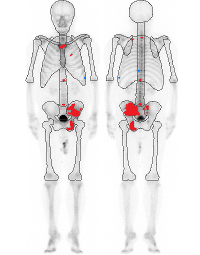
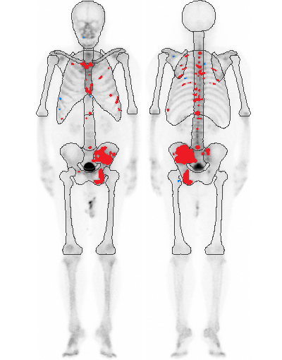
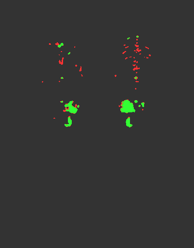

# Image Analysis Script

[English](./README.md) | [日本語](./README_JA.md)

This project contains a Python script for comparing two images and analyzing the similarity of specific color regions (red and blue). It is designed to run in a Jupyter Notebook environment.

## Features

- Image alignment based on contours
- Segmentation of red and blue color regions
- Similarity calculation using Dice coefficient and Hausdorff distance
- Generation of overlay images visualizing matching and non-matching regions

## Requirements

- Python 3.6 or higher
- Jupyter Notebook

## Required Python Modules

The following Python modules are required:

- opencv-python (cv2)
- numpy
- scikit-image
- scipy
- matplotlib

You can install these modules using the following command:

```
pip install opencv-python numpy scikit-image scipy matplotlib
```

## Usage

1. Clone or download this repository.

2. Prepare two image files you want to compare and place them in the same directory as the script.
   - Default file names:
     - `0130000001-1_origin_output.png`
     - `0130000001-1_filter_output.png`
   - If you use different images, modify the `img1_path` and `img2_path` variables in the script accordingly.

3. Launch Jupyter Notebook:
   ```
   jupyter notebook
   ```

4. Create a new notebook and copy & paste the provided script content into a cell.

5. Run the cell. The results will display:
   - Dice coefficients for red and blue regions
   - Hausdorff distances for red and blue regions
   - Overlay images showing matching and non-matching areas

## Example

Here's an example of how the script works with actual images:

### Input Images

Image 1 (Origin):



Image 2 (Filter):



### Result Images

Image 3 (Comparison of Red Regions):



In the result images:
- Green areas indicate matching regions between the two input images.
- Red areas in Image 3 show red regions that don't match between the inputs.

The script calculates Dice coefficients and Hausdorff distances for both red and blue regions, providing a quantitative measure of similarity between the two input images.

## Customization

- Adjusting color ranges: Modify the `lower_red1`, `upper_red1`, `lower_red2`, `upper_red2`, `lower_blue`, and `upper_blue` variables to change the color detection ranges.
- Overlay transparency: Change the `alpha` parameter in the `create_overlay_image_with_white_background` function to adjust the transparency of the overlay images.

## Notes

- Alignment and segmentation results may vary depending on the size and format of the images.
- Processing large images may take longer to execute.

## Troubleshooting

- If you encounter module import errors, ensure that the required modules are correctly installed.
- If you experience image loading errors, check that the file paths are correct and the image files exist.

If you have any questions or issues, please feel free to open an Issue.

---
## Similarity Calculation Methods

This script uses two main metrics to calculate the similarity between images:

### Dice Coefficient

The Dice coefficient is a statistical metric used to measure the degree of overlap between two sample sets. In the context of image analysis, it is used to measure the similarity between two regions (segments).

- Formula: Dice = (2 * |X ∩ Y|) / (|X| + |Y|)
  - X and Y are the two sets being compared (in this case, specific color regions of the images)
  - |X ∩ Y| is the number of elements common to both sets
  - |X| and |Y| are the number of elements in each set

- Value range: 0 to 1
  - Values closer to 1 indicate that the two regions are very similar
  - Values closer to 0 indicate that the two regions are completely different

### Hausdorff Distance

The Hausdorff distance is a metric used to measure the similarity between two point sets. In image analysis, it is used to quantify differences between two shapes or contours.

- Calculation method:
  1. Calculate the distance from each point in set A to the nearest point in set B
  2. Calculate the distance from each point in set B to the nearest point in set A
  3. The Hausdorff distance is the maximum of all these distances

- Characteristics:
  - Represents the overall similarity of two shapes with a single value
  - Smaller values indicate that the two shapes are more similar
  - Sensitive to outliers

By combining these metrics, we can comprehensively evaluate the similarity of images from both the perspective of color region overlap (Dice coefficient) and shape similarity (Hausdorff distance).

